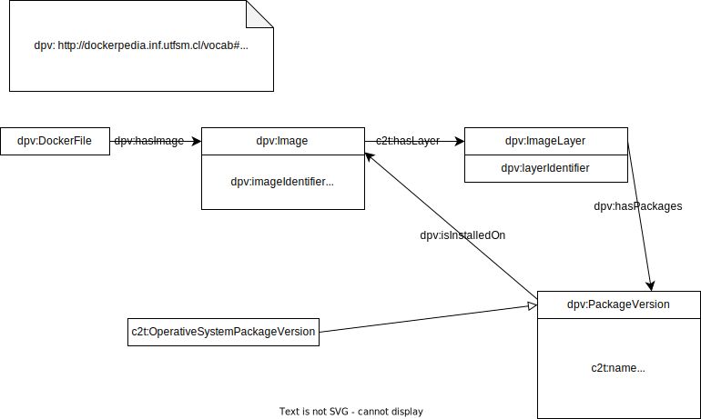

What we do is transform docker images into knowledge graphs.
## Installation
For using this repo we asume that you have installed:
- [docker](https://docs.docker.com/engine/install/)
- [syft](https://github.com/anchore/syft)
- [python 3.10.4](https://www.python.org/downloads/release/python-3104/)

## Usage
Local images
``` bash
CLI.py image {name} {output}
```
DockerHub images
``` bash
CLI.py dockerhub {name} {output}
```
DockerFiles
``` bash
CLI.py dockerfile {name} {output}
```

## How it works
We inspect your image to get enviroment properties. Then we use syft to obtain the image dependencies. After that we have to [transform](syft_parser.py) a bit the output.

Once we have these data sources, we have to create a knowledge graph. For this purpose we will use [morphkgc](https://github.com/oeg-upm/morph-kgc)

## Ontology Documentation
Available here: [https://osoc-es.github.io/c2t/myDocumentation_2/index-en.html](https://osoc-es.github.io/c2t/myDocumentation_2/index-en.html)

## Ontology diagram

