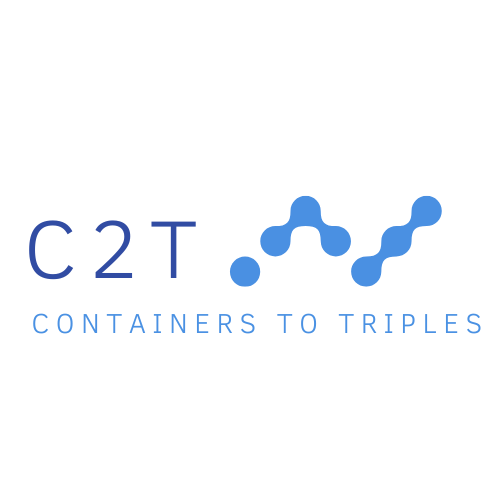
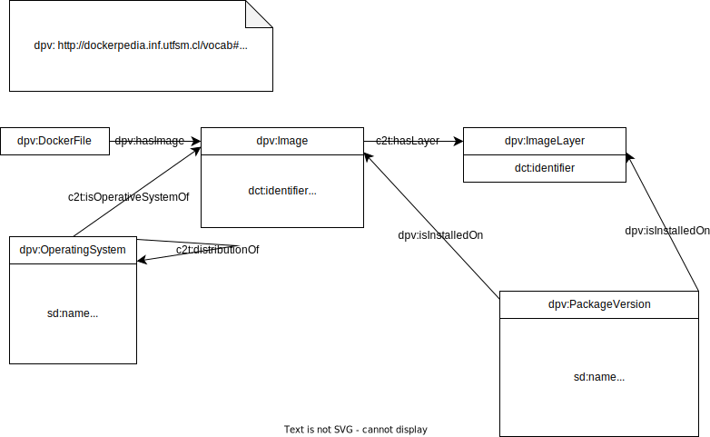

What we do is transform docker images into knowledge graphs.
## Installation
For using this repo we asume that you have installed:
- [docker](https://docs.docker.com/engine/install/)
- [syft](https://github.com/anchore/syft)
- [python 3.10.4](https://www.python.org/downloads/release/python-3104/)

## Usage
To create your knowledge graph from your Docker container you must run one of these commands. (add -s to the command to save the json files in the output_path)

To create the graph from a local image: ({name} can be Image ID or image tag)

``` bash
py CLI.py image -i {name} -o {output_path}
```

To create the graph from a file with a list of local images (the file must have this format: 

"mongo:latest

python:3.10 

mysql:latest")

```bash
py CLI.py image -p {file_path} -o {output_path}
```

To create the graph from a DockerHub image:

```bash
py CLI.py dockerhub -i {name} -o {output_path}
```

To create the graph from a file with a list of DockerHub images (the file must have this format: 

"mongo:latest

python:3.10 

mysql:latest")

```bash
py CLI.py dockerhub -p {file_path} -o {output_path}
```

To create the graph from a DockerFile:

```bash
py CLI.py dockerhub -p {dockerhub_path} -o {output_path}
```


## How it works
We inspect your image to get enviroment properties. Then we use syft to obtain the image dependencies. After that we have to [transform](syft_parser.py) a bit the output.

Once we have these data sources, we have to create a knowledge graph. For this purpose we will use [morphkgc](https://github.com/oeg-upm/morph-kgc)

## Ontology Documentation
Available here: [https://osoc-es.github.io/c2t/onto_documentation/index-en.html](https://osoc-es.github.io/c2t/onto_documentation/index-en.html)

## Landing Page
Available here: [https://osoc-es.github.io/c2t/website](https://osoc-es.github.io/c2t/website)

## Ontology diagram

